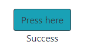

# 1.1

Input: `docker ps -a`

Output:
```
CONTAINER ID   IMAGE     COMMAND                  CREATED          STATUS                      PORTS     NAMES
1b540a079b83   nginx     "/docker-entrypoint.…"   40 seconds ago   Exited (0) 10 seconds ago             nifty_mcclintock
bb5f4180c693   nginx     "/docker-entrypoint.…"   41 seconds ago   Exited (0) 10 seconds ago             goofy_dhawan
b3a3e487d0ad   nginx     "/docker-entrypoint.…"   42 seconds ago   Up 41 seconds               80/tcp    heuristic_gates
```

# 1.2

Input: `docker ps -a`

Output:
```
CONTAINER ID   IMAGE     COMMAND   CREATED   STATUS    PORTS     NAMES
```

Input: `docker images`

Output:
```
REPOSITORY   TAG       IMAGE ID   CREATED   SIZE
```


# 1.3

Input:
```sh
docker image pull devopsdockeruh/simple-web-service:ubuntu
docker run -it 4e
docker exec -it 21 bash
tail -f ./text.log
```

Output:
```
Secret message is: 'You can find the source code here: https://github.com/docker-hy'
```

# 1.4

Input:
```sh
docker run -it ubuntu sh -c 'apt-get update > /dev/null && apt-get -y install curl > /dev/null; echo "Input website:"; read website; echo "Searching.."; sleep 1; curl http://$website;'
```

Output:
```HTML
Input website:
helsinki.fi
Searching..
<!DOCTYPE HTML PUBLIC "-//IETF//DTD HTML 2.0//EN">
<html><head>
<title>301 Moved Permanently</title>
</head><body>
<h1>Moved Permanently</h1>
<p>The document has moved <a href="https://www.helsinki.fi/">here</a>.</p>
</body></html>
```

# 1.5

Input:
```sh
docker pull devopsdockeruh/simple-web-service:ubuntu
docker pull devopsdockeruh/simple-web-service:alpine
docker image ls
```

Output:
```
REPOSITORY                          TAG       IMAGE ID       CREATED        SIZE
ubuntu                              latest    7e0aa2d69a15   7 weeks ago    72.7MB
devopsdockeruh/simple-web-service   ubuntu    4e3362e907d5   3 months ago   83MB
devopsdockeruh/simple-web-service   alpine    fd312adc88e0   3 months ago   15.7MB
```

Input:
```sh
docker run -d fd
docker exec -it 555 sh
tail -f ./text.log
```

Output:
```
Secret message is: 'You can find the source code here: https://github.com/docker-hy'
```
# 1.6

Password found [here](https://hub.docker.com/r/devopsdockeruh/pull_exercise).

Input:
```
docker run -it devopsdockeruh/pull_exercise
```

Output:
```
Give me the password: basics
You found the correct password. Secret message is:
"This is the secret message"
```

# 1.7

[Dockerfile](7/Dockerfile)

Input:
```sh
docker build . -t web-server
docker run web-server
```

Output:
```
[GIN-debug] [WARNING] Creating an Engine instance with the Logger and Recovery middleware already attached.

[GIN-debug] [WARNING] Running in "debug" mode. Switch to "release" mode in production.
 - using env:   export GIN_MODE=release
 - using code:  gin.SetMode(gin.ReleaseMode)

[GIN-debug] GET    /*path                    --> server.Start.func1 (3 handlers)
[GIN-debug] Listening and serving HTTP on :8080
```

# 1.8

[Dockerfile](8/Dockerfile)

Input:
```sh
docker build . -t script:curler
docker run -it script:curler
```

# 1.9

Input:
```sh
touch /tmp/log.txt
docker run -v ${pwd}/tmp/log.txt:/usr/src/app/text.log devopsdockeruh/simple-web-service
```

# 1.10

Input:
```sh
docker run -d -it -p 8080:8080 --name port-mapping devopsdockeruh/simple-web-service sh -c 'server'
```

# 1.11

[Dockerfile](11/Dockerfile)

Input:
```sh
docker build . -t java-app
docker run -d -p 8080:8080 java-app
```



# 1.12

[Dockerfile](12/Dockerfile)

Input:
```sh
docker build . -t frontend-node
docker run -d -p 5000:5000 frontend-node
```

> Exercise 1.12: Congratulations! You configured your ports correctly!

# 1.13

[Dockerfile](13/Dockerfile)

Input:
```sh
docker build . -t backend-go
docker run -d -p 8080:8080 backend-go
```

> pong

# 1.14

[Frontend Dockerfile](14/Dockerfile.frontend)
```sh
docker build . -t frontend-node
docker run -d -p 5000:5000 frontend-node
```

[Backend Dockerfile](14/Dockerfile.backend)
```sh
docker build . -t backend-go
docker run -d -p 8080:8080 backend-go
```

# 1.15

[Docker Hub repository](https://hub.docker.com/r/luukuton/youtube-dl-hy2021)

# 1.16

[Heroku app](https://devopsdocker-exercise.herokuapp.com/)

