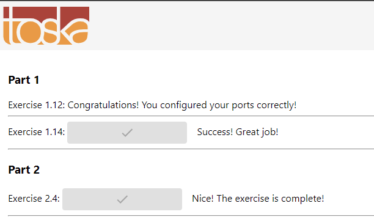
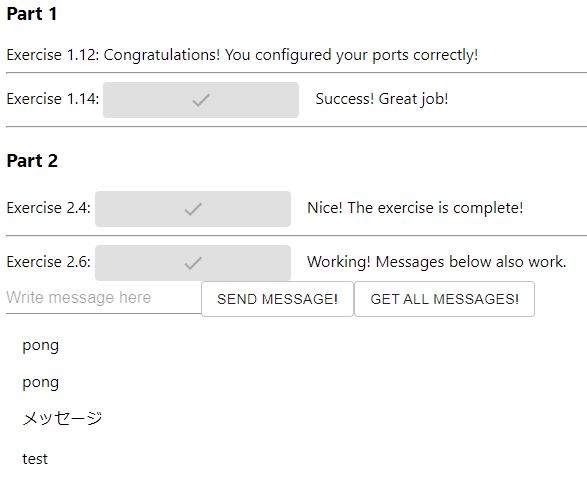
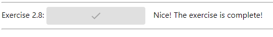

# Part Two Exercises

## 2.1

[docker-compose.yml](01/docker-compose.yml)

## 2.2

[docker-compose.yml](02/docker-compose.yml)

## 2.3

[docker-compose.yml](03/docker-compose.yml)

## 2.4

[docker-compose.yml](04/docker-compose.yml)

[Dockerfile (frontend)](04/frontend/Dockerfile)

[Dockerfile (backend)](04/backend/Dockerfile)



## 2.5

```sh
docker-compose up --scale compute=10
```

## 2.6

[docker-compose.yml](06/docker-compose.yml)



## 2.7

[docker-compose.yml](07/docker-compose.yml)

## 2.8

[docker-compose.yml](08/docker-compose.yml)

[nginx.conf](08/nginx.conf)



## 2.9

[docker-compose.yml](09/docker-compose.yml)

## 2.10

Removed the port from the env REQUEST_ORIGIN in backend as NGINX handles that.

[Dockerfile (frontend)](10/frontend/Dockerfile)

[Dockerfile (backend)](10/backend/Dockerfile)

[docker-compose.yml](10/docker-compose.yml)

[nginx.conf](10/nginx.conf)


## 2.11

Skipped as skipping one non-mandatory exercise per part [is allowed](https://devopswithdocker.com/exercises/).

> To get a passing grade, you have to do every exercise, except you can skip one exercise for each part. You can not “save” skips between parts and skip two exercises in a later part. Some of the exercises are marked as mandatory, and they can not be skipped.