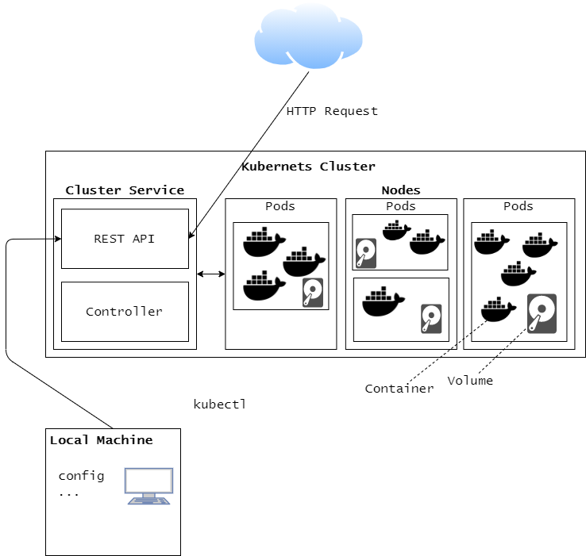

# Part Three Exercises

## 3.1

[GitHub repository](https://github.com/Luukuton/docker-hy.github.io)

[Heroku deployment](https://docker-hy-luukuton.herokuapp.com)

[DockerHub repository](https://hub.docker.com/r/luukuton/docker-hy)

## 3.2

Commands:
```sh
docker-compose up -d --build
docker exec -ti build-assignment-hy /script.sh
```

[Dockerfile](02/Dockerfile)

[docker-compose.yml](02/Dockerfile)

[script.sh](02/script.sh)

## 3.3

Changes from [2.10](../part2/10):
- [Dockerfile (frontend)](03/frontend/Dockerfile)
- [Dockerfile (backend)](03/backend/Dockerfile)

## 3.4

Frontend (node) size reduced from 1.17GB to 343MB and backend (golang) reduced from 1.01GB to 448MB.

Changes from [3.3](./3.3):
- [Dockerfile (frontend)](03/frontend/Dockerfile)
- [Dockerfile (backend)](03/backend/Dockerfile)

## 3.5

```Docker
FROM node:14        # 1.17GB 
FROM node:14-alpine # 343MB

FROM golang:1.16        # 1.01GB
FROM golang:1.16-alpine # 448MB
```

## 3.6 (Multi-stage frontend & backend)

Frontend (node) size reduced from  343MB to **309MB** and backend (golang) reduced from 448MB to **18.7MB**.

Changes from [3.4](./3.4):
- [Dockerfile (frontend)](06/frontend/Dockerfile)
- [Dockerfile (backend)](06/backend/Dockerfile)
- [docker-compose.yml](06/docker-compose.yml)

## 3.7

Skipped as skipping one non-mandatory exercise per part [is allowed](https://devopswithdocker.com/exercises/).

> To get a passing grade, you have to do every exercise, except you can skip one exercise for each part. You can not “save” skips between parts and skip two exercises in a later part. Some of the exercises are marked as mandatory, and they can not be skipped.

## 3.8


